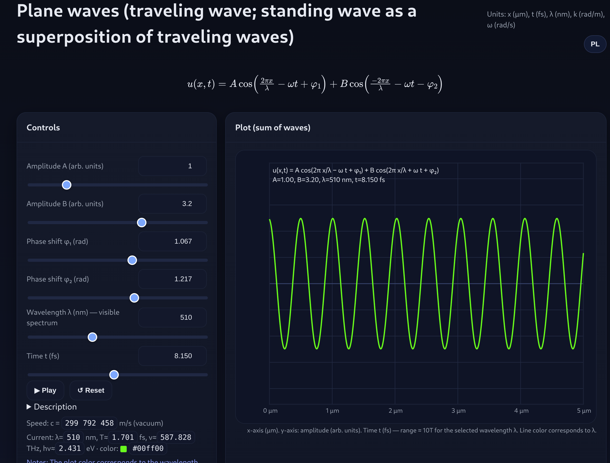
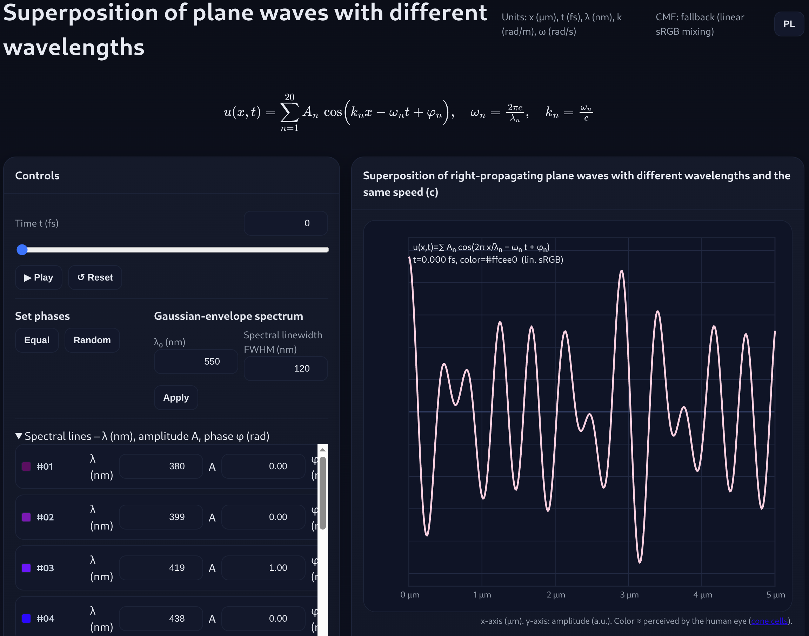
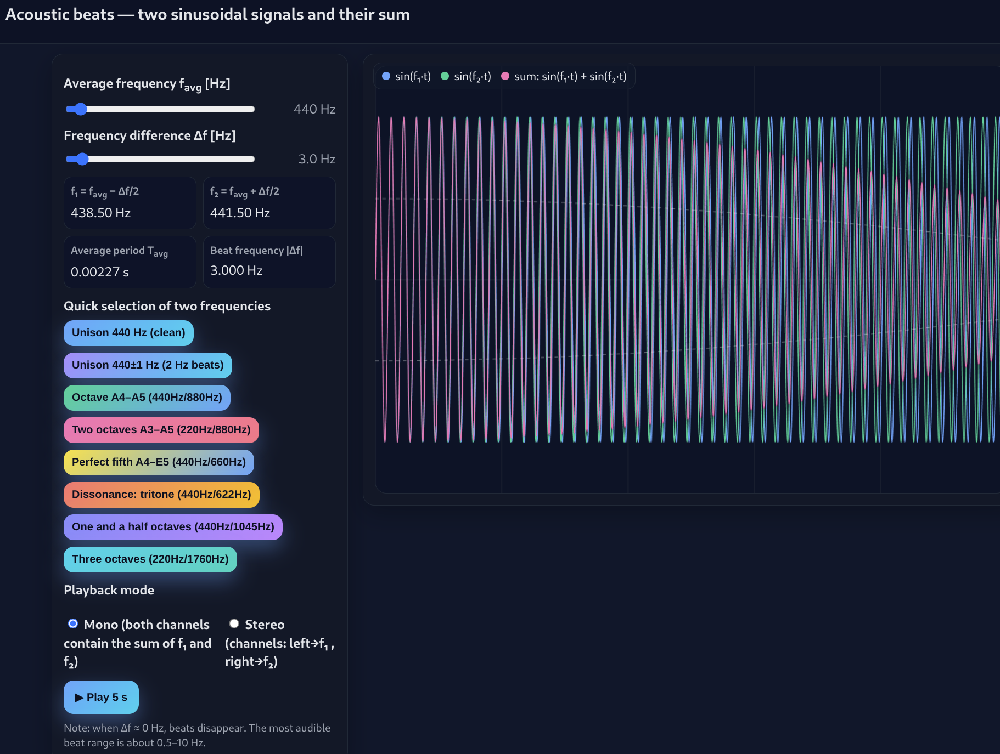
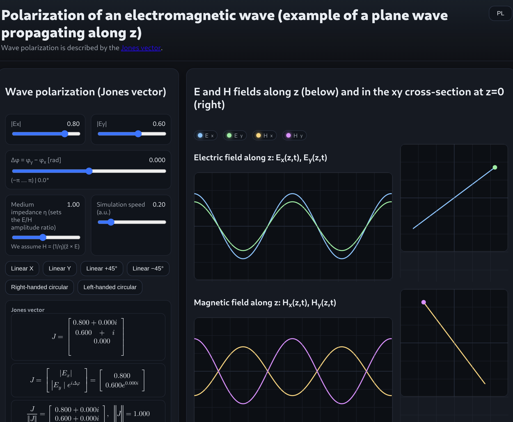
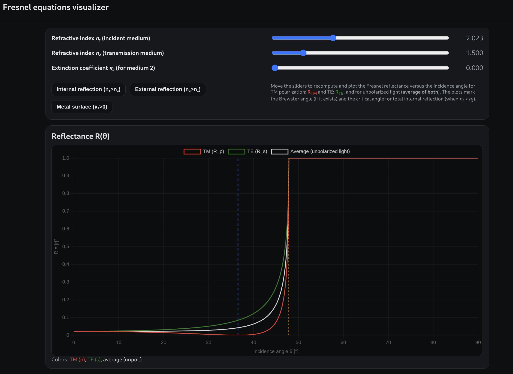

# Photonics Toys

**Photonics Toys** is a collection of interactive educational simulations for teaching and learning optics, photonics, and wave physics.

The repository contains browser-based HTML/JavaScript visualizations as well as Python-based educational programs. 
All simulations are designed for intuitive exploration of physical concepts and are suitable for university-level optics and physics courses.

## 🌐 Interactive HTML Simulations
---

### 1. Traveling and Standing Plane Waves
**Concepts:** traveling waves, standing waves, phase, interference 

📄 Program: 
[html/standing-and-traveling-waves/index.html](https://htmlpreview.github.io/?https://github.com/rkotynski/photonicstoys/blob/main/html/standing-and-traveling-waves/index.html) 

🖼 Screenshot: 

---

All HTML programs work locally in a web browser (no installation required).

### 2. Superposition of Plane Waves with Different Wavelengths
**Concepts:** wave superposition, spectra, coherence, color perception 

📄 Program: 
[html/plane-wave-superposition/index.html](https://htmlpreview.github.io/?https://github.com/rkotynski/photonicstoys/blob/main/html/plane-wave-superposition/index.html) 

🖼 Screenshot: 

---

### 3. (Acoustic) Wave Beating
**Concepts:** beats, frequency difference, interference in time 

📄 Program: 
[html/acoustic-wave-beating/index.html](https://htmlpreview.github.io/?https://github.com/rkotynski/photonicstoys/blob/main/html/acoustic-wave-beating/index.html) 

🖼 Screenshot: 

---

### 4. Polarization and Jones Vectors
**Concepts:** polarization states, Jones calculus, linear/circular/elliptical polarization 

📄 Program: 
[html/plane-wave-polarization/index.html](https://htmlpreview.github.io/?https://github.com/rkotynski/photonicstoys/blob/main/html/plane-wave-polarization/index.html) 

🖼 Screenshot: 

---

### 5. Fresnel Reflection and Transmission Coefficients
**Concepts:** Fresnel equations, Brewster angle, critical angle, polarization-dependent reflection 

📄 Program: 
[html/fresnel-coefficients/index.html](https://htmlpreview.github.io/?https://github.com/rkotynski/photonicstoys/blob/main/html/fresnel-coefficients/index.html) 

🖼 Screenshot: 

## 🌍 Language Support

All HTML simulations support:
- 🇵🇱 Polish (default)
- 🇬🇧 English 
Language can be switched interactively using a button in the interface.

---

## 📜 License

